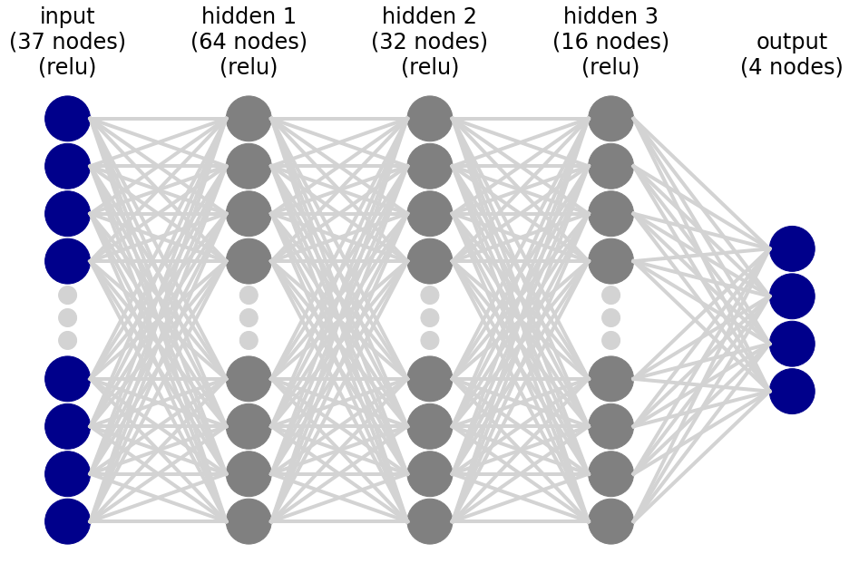

# Submission Report

## Results

The goal of the project is to train an agent such that it gets an average score of +13 over 100 consecutive episodes. The agent here achieved an average score of 16.37 over 100 episodes.

## Learning Algorithm

The agent uses a Deep Q-Network to learn i.e. the agent uses a Deep neural nework (model) for calculating the Q-values given a state, and the agent employs Q-Learning algorithm (with replay buffer) to train the network.

To explain the algorithm in detail -
 * The Deep Q-network has 5 layers.
   * An input layer of size 37 corresponding 37 dimensions of state, with ReLU activations.
   * Three hidden layers of size 64,32,16 respectively, each with ReLU activations
   * An output layer of size 4. The outputs correspond to the Q-values for the four actions
   
 * The agent has instances of the  Q-network - *qnetwork_local and qnetwork_target*
 * At every step, the agent uses the output of *qnetwork_local*, and an epsilon greedy policy to determine current action. The agent interacts with the environment to determine *next_state* and *reward*
 * The agent converts the parameters *state, action, reward, next_state* and *done* into *experiences* and stores them in a replay buffer.   
 * Every four steps (determined by hyper-parameter *UPDATE_EVERY*), *experieces* are sampled from the replay buffer. 
 * Agent then uses Q-learning algorithm to calculate new Q-values based on rewards and current Q-values as output by *qnetwork_target*. The agent aims to train *qnetwork_local* to achieve these calculated outputs. So agent formulates a *loss* variable as the difference between the above calculated outputs and the outputs of *qnetwork_local*. *qnetwork_local* is trained by optimizing the above *loss*
 * After training *qnetwork_local* on a batch of experiences, the weights of *qnetwork_target* are updated with those of *qnetwork_local* using an update fraction hyper-parameter *tau*

## Training performance

The environment was solved in 600 episodes

The rolling 100-episode average reward observed during training is as follows
| Episode Count | Rolling reward average |
|-------------- | ----------------------|
|Episode 100  |Average Score: 0.93 | 
|Episode 200  |Average Score: 3.73 |
|Episode 300  |Average Score: 7.12 |
|Episode 400  |Average Score: 10.17|
|Episode 500  |Average Score: 12.45|
|Episode 600  |Average Score: 14.89|
|Episode 700  |Average Score: 15.22|
|Episode 800  |Average Score: 16.12|
|Episode 900  |Average Score: 17.20|
|Episode 1000 |Average Score: 16.37|
|-------------- | ----------------------|

## Plot of Rewards

A plot of the rewards during training is shown below 

## Ideas for Future Work

The current solution uses a deep network that represents Q-values. We can try a solution with a deep nework that directly represents the policy.

